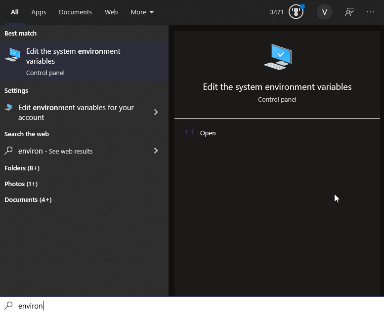
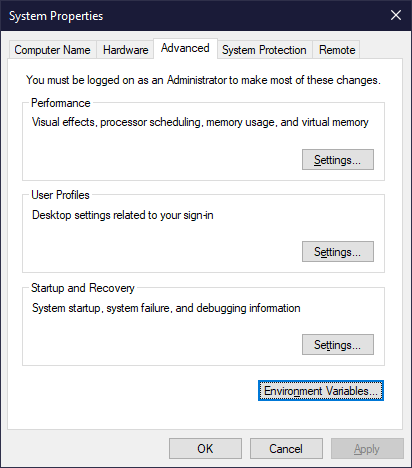
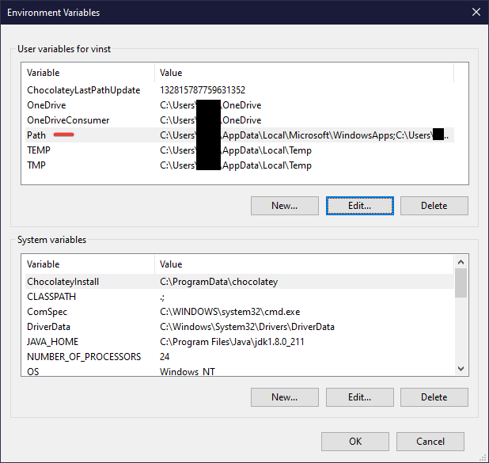
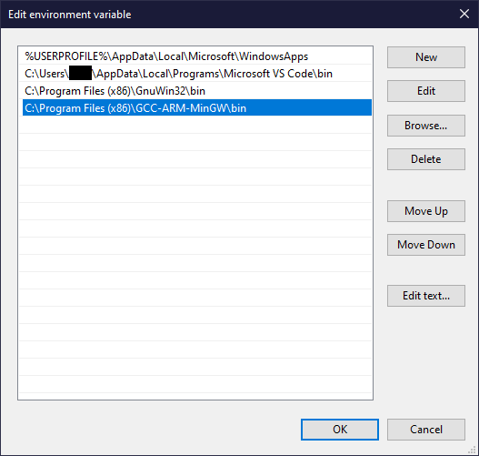
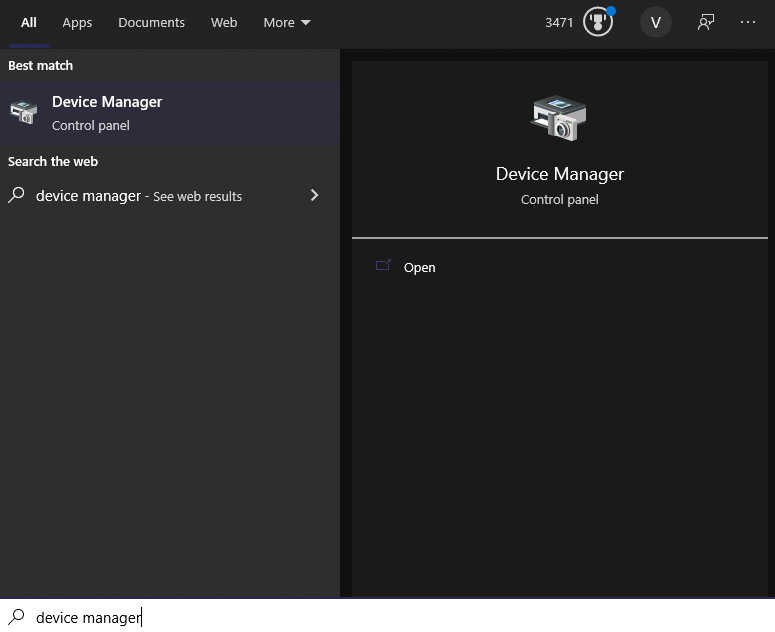
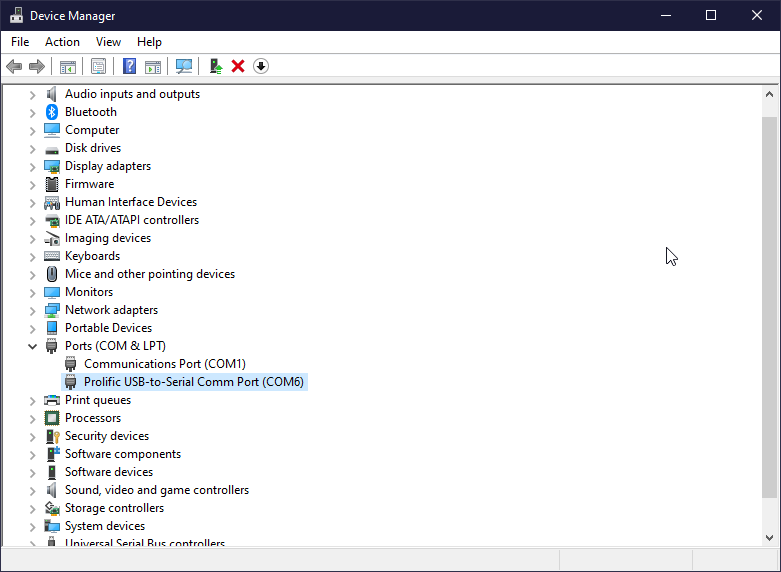
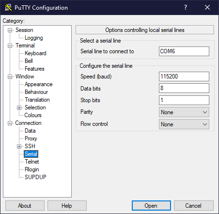
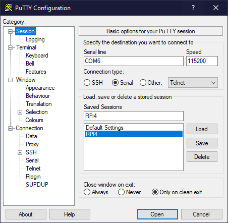

# 01-01 Initial Setup

Let's talk about setting up the Raspberry Pi in order to code baremetal
projects.

## Software Installation

### Installing the GNU Toolchain

First, we need to install an assembler. This will take our assembly code and
convert it into binary code that the machine will read.

Sadly, there are no easy installers for this. You'll have to install everything
manually.

The download link is here:
[GNU AARCH64 ARM Toolchain](https://developer.arm.com/tools-and-software/open-source-software/developer-tools/gnu-toolchain/gnu-a/downloads)

You must install the AArch64 Bare-Metal target (aarch64-none-elf). As of writing
this guide, the current version is:
`gcc-arm-10.3-2021.07-mingw-w64-i686-aarch64-none-elf.tar.xz`.

Using WinRAR or 7Zip, open this file. In `C:/Program Files (x86)`, create a new
folder (I called mine `GCC-ARM-MinGW`.) Place all of the files within
`gcc-arm-10.3-2021.07-mingw-w64-i686-aarch64-none-elf` in this new folder. Your
directory should look like this:

```
C:/Program Files (x86)/GCC-ARM-MinGW
├─ aarch64-none-elf
├─ bin
├─ include
├─ lib
├─ libexec
├─ share
└─ 10.3-2021.07-mingw-w64-i686-aarch64-none-elf-manifest.txt
```

Now we have to add the `bin` folder to our PATH, which allows a command prompt
or other shell access to the compiler programs we just installed. Press the
Windows button, then type in `Environment Variables.`



In this page, click on `Environment Variables...`



In this page, ensure that `Path` is selected, and press `Edit...`



This is a list of strings. Add a string for the `bin` folder of the new folder
you just created. An example is below. Don't modify any other strings - Other
programs might use those, and changing the other strings might break
installations of other things.



Press `OK` and `Apply` as you leave the variables section. Once you get out of
these menus, you're done installing the toolchain.

### Installing MAKE

MAKE is a GNU (C compiler) utility to quickly build C programs from groupings of
files. It's a tool which simplifies generation of executables - You've probably
used it before in CMPSC 311.

If you have a Mac, you'll have to use Xcode from the App Store. You can start
Xcode, then go to `Xcode -> Preferences -> Downloads` and install the component
called "Command Line Tools." After that, all the relevant tools will be placed
in the `/usr/bin` folder, and you'll be able to use it just as it was in 10.6.

The download link for Windows is here:
[Make for Windows](http://gnuwin32.sourceforge.net/packages/make.htm)

Run the executable, and allow it to download everything that's already checked.
Press Finish and you'll be done with Make.

### Installing PuTTY

PuTTY is a terminal application that allows you to connect (via SSH) into
clients. It's an open-source software, and you can download it
[here](https://www.chiark.greenend.org.uk/~sgtatham/putty/latest.html).

We'll be using PuTTY to connect to the serial terminal on the Raspberry Pi.

For modern Windows machines, install the 64-bit x86 application. It's a simple
installer with no settings to mess with.

Press the Windows button, and type Device Manager.



Under the Ports dropdown, you should see a listing of the connected ports. If
your USB-TTL cable is plugged into your PC, you should be able to see the device
loaded in. Keep a mental note of which COM port it is - Mine is COM6.



In PuTTY, click `Connection > Serial` and configure the settings like this.
Change the `Serial line to connect to` box to whatever COM port you have on your
PC.



Then, click on `Session`, set the `Connection Type` to `Serial`, and notice that
the `Serial line` and `Speed` have automatically updated to your settings. Write
`RPi` in the `Saved Sessions` box and press `Save` to save this configuration
for later use. I named mine `RPi4` since I'm using a Raspberry Pi 4, but the
settings are the exact same with other Raspberry Pi models as well.



Every time you connect to your Raspberry Pi, you can simply load the `RPi`
session and press `Open` to open a terminal. This terminal will communicate with
your Raspberry Pi through the USB-TTL cable.

### Installing an IDE

If you have a Mac, you already need Xcode, as the Make utility will be installed
through it. Once the utility is installed, you should be able to choose your own
IDE freely.

IDE choice is completely optional and personal, though I would highly recommend
[Visual Studio Code](https://code.visualstudio.com/). There are hundreds of
thousands of videos online teaching you how to set it up and customize the UI.
Other fully customizable IDEs like [Atom](https://atom.io/) also work. Even
[Notepad++](https://notepad-plus-plus.org/) works, and offers syntax
highlighting for ARM assembly.

For Visual Studio Code users, there is an
[extension for ARM assembly](https://marketplace.visualstudio.com/items?itemName=dan-c-underwood.arm)
specifically, created by Dan C Underwood from the University of Manchester. This
adds syntax highlighting (pretty colors) to any assembly code you will write
throughout the semester, and helps you keep track of your code.

Seasoned users to VSCode will be sad to hear that there are currently no
automatic formatters for ARM code. If this changes in the future, please reach
out to us!

You can also use other IDEs such as [Eclipse](https://www.eclipse.org/), though
these IDEs have significantly higher amounts of bloatware and unnecessary
features.

If you don't like any IDEs, you can even use Notepad on Windows. It will be
harder to find errors in your code, though.

## Hardware Setup

You need an SD card to install the Serial Terminal code.

https://www.instructables.com/Bare-Metal-Raspberry-Pi-3Blinking-LED/
