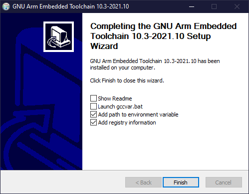

# 01-01 Initial Setup

Let's talk about setting up the Raspberry Pi in order to code baremetal.

## Software Installation

### Installing the GNU Toolchain

First, we need to install an assembler. This will take our assembly code and
convert it into binary code that the machine will read.

The download link is here:
[GNU ARM Toolchain](https://developer.arm.com/tools-and-software/open-source-software/developer-tools/gnu-toolchain/gnu-rm/downloads)

On a Windows system, you would install the Windows 32-bit installer (even if you
have a 64-bit machine.) As of writing this guide, the current version is named:
`gcc-arm-none-eabi-10.3-2021.10-win32.exe`

Run that executable, and allow it to install wherever it wants (or choose a home
for it, if you so wish.)

On the end screen, make sure you check the boxes
`Add path to environment variable` and `Add registry information.` If you did
not check these boxes, you may have to re-run the installer.

Press Finish, and you've installed the toolchain.

### Installing MAKE

MAKE is a GNU (C compiler) utility to quickly build C programs from groupings of
files. It's a tool which simplifies generation of executables - You've probably
used it before in CMPSC 311.

If you have a Mac, you'll have to use Xcode from the App Store. You can start
Xcode, then go to `Xcode -> Preferences -> Downloads` and install the component
called "Command Line Tools." After that, all the relevant tools will be placed
in the `/usr/bin` folder, and you'll be able to use it just as it was in 10.6.

The download link for Windows is here:
[Make for Windows](http://gnuwin32.sourceforge.net/packages/make.htm)

Run the executable, and allow it to download everything that's already checked.
Press Finish and you'll be done with Make.

### Installing an IDE

If you have a Mac, you already need Xcode, as the Make utility will be installed
through it. Once the utility is installed, you should be able to choose your own
IDE freely.

IDE choice is completely optional and personal, though I would highly recommend
[Visual Studio Code](https://code.visualstudio.com/). There are hundreds of
thousands of videos online teaching you how to set it up and customize the UI.
Other fully customizable IDEs like [Atom](https://atom.io/) also work. Even
[Notepad++](https://notepad-plus-plus.org/) works, and offers syntax
highlighting for ARM assembly.

For Visual Studio Code users, there is an
[extension for ARM assembly](https://marketplace.visualstudio.com/items?itemName=dan-c-underwood.arm)
specifically, created by Dan C Underwood from the University of Manchester. This
adds syntax highlighting (pretty colors) to any assembly code you will write
throughout the semester, and helps you keep track of your code.

Seasoned users to VSCode will be sad to hear that there are currently no
automatic formatters for ARM code. If this changes in the future, please reach
out to us!

You can also use other IDEs such as [Eclipse](https://www.eclipse.org/), though
these IDEs have significantly higher amounts of bloatware and unnecessary
features.

If you don't like any IDEs, you can even use Notepad on Windows. It will be
harder to find errors in your code, though.

## Hardware Setup

You need an SD card to install the Serial Terminal code.
